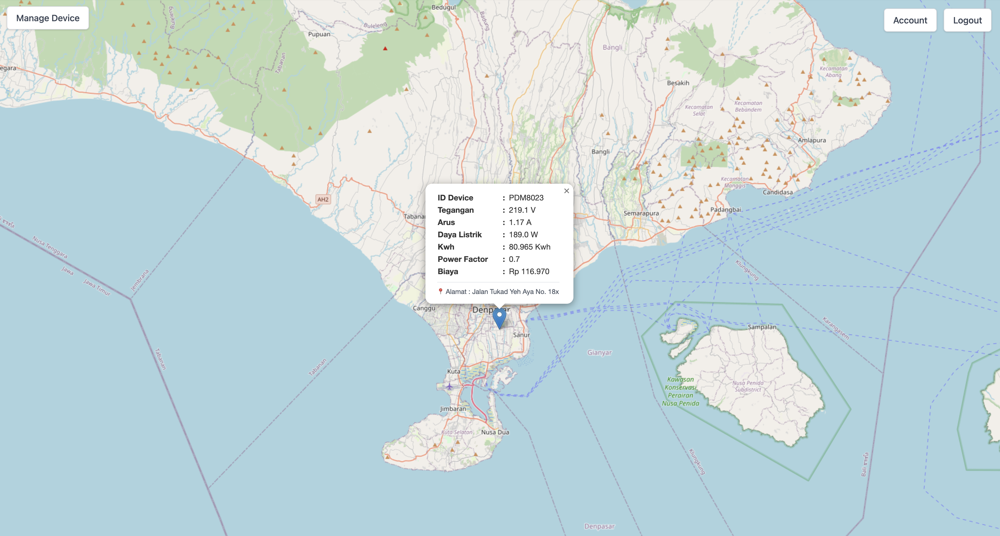

# Data IoT Locator

Sistem manajemen perangkat IoT berbasis web yang melacak dan memantau perangkat IoT menggunakan protokol MQTT dan menampilkan lokasinya pada peta.

## Fitur

- Sistem Manajemen Pengguna
  - Login Admin
  - Registrasi Pengguna
  - Kontrol akses berbasis peran

- Manajemen Perangkat
  - Tambah perangkat IoT baru
  - Konfigurasi pengaturan MQTT
  - Langganan beberapa topik dengan deskripsi
  - Pelacakan lokasi perangkat

- Pemantauan Real-time
  - Tampilan data sensor langsung
  - Visualisasi perangkat berbasis peta
  - Informasi perangkat interaktif

## Struktur Proyek

```
.
├── backend/           # Server backend Node.js
├── js/               # File JavaScript frontend
├── dashboard.html    # Antarmuka dasbor utama
├── index.html        # Halaman login
└── user-management.html # Antarmuka manajemen pengguna
```

## Catatan Pembaruan (Mei 2025)

### Pembaruan Terbaru

- Menambahkan tampilan ID perangkat sebagai tooltip pada penanda peta untuk identifikasi perangkat yang lebih baik
- Mengimplementasikan penanganan data MQTT untuk mempertahankan nilai sensor valid sebelumnya ketika menerima NaN
- Meningkatkan gaya penanda peta untuk visibilitas yang lebih baik
- Meningkatkan penanganan pesan MQTT untuk tampilan data yang lebih andal
- Memperbaiki masalah dengan nilai NaN dalam data sensor yang menyebabkan masalah tampilan

### Pembaruan Sebelumnya

- Memperbaiki bug di mana alamat perangkat (alamatLokasi) dapat muncul sebagai `[object Object]`
- Backend sekarang selalu menyimpan `alamatLokasi` sebagai string, tidak pernah sebagai objek
- Frontend sekarang secara andal mengirimkan nilai string yang benar untuk alamat perangkat
- UI daftar perangkat: alamat perangkat sekarang ditampilkan dengan pin lokasi (📍) dan gaya font normal (tidak miring)
- Meningkatkan keandalan alur registrasi dan pengeditan perangkat

## Prasyarat

- Node.js (v14 atau lebih tinggi)
- npm (Node Package Manager)
- Broker MQTT (misalnya, Mosquitto)
- Peramban web (Chrome disarankan)

## Instalasi

1. Klon repository:
   ```bash
   git clone https://github.com/duwiarsana/iot-locator-data.git
   cd iot-locator-data
   ```

2. Instal dependensi backend:
   ```bash
   cd backend
   npm install
   ```

3. Jalankan server backend:
   ```bash
   node server.js
   ```

4. Buka peramban web dan navigasikan ke:
   - Halaman login: `http://localhost:3000`
   - Dasbor: `http://localhost:3000/dashboard`
   - Manajemen pengguna: `http://localhost:3000/user-management`

## Penggunaan

1. **Login**
   - Akses halaman login di `http://localhost:3000`
   - Gunakan kredensial admin untuk login

2. **Pendaftaran Perangkat**
   - Klik "Tambah Perangkat Baru" di dasbor
   - Isi detail perangkat:
     - ID perangkat
     - IP dan port MQTT
     - Koordinat lokasi (latitude, longitude)
     - Tambahkan beberapa topik MQTT dengan deskripsi
   - Klik "Daftar" untuk menyimpan perangkat

3. **Pemantauan**
   - Lihat perangkat di peta
   - Klik pada penanda untuk melihat informasi detail
   - Perbaruan data sensor real-time

## Screenshots Dashboard



Tampilan dashboard utama yang menampilkan perangkat IoT beserta data sensor secara real-time pada peta interaktif.


## Konfigurasi

### Konfigurasi Backend

Server backend menggunakan database SQLite untuk manajemen pengguna dan pengaturan perangkat. Konfigurasi diatur di `backend/server.js`.

### Konfigurasi MQTT

Perangkat terhubung ke broker MQTT menggunakan IP dan port yang dikonfigurasi. Server backend berlangganan ke topik yang dikonfigurasi untuk menerima data sensor.

## Keamanan

- Kata sandi di-hash sebelum disimpan
- Akses hanya untuk admin untuk pendaftaran perangkat dan manajemen pengguna
- Manajemen sesi yang aman

## Kontribusi

1. Fork repository
2. Buat cabang fitur Anda (`git checkout -b feature/FiturMenakjubkan`)
3. Commit perubahan Anda (`git commit -m 'Menambahkan beberapa FiturMenakjubkan'`)
4. Push ke cabang (`git push origin feature/FiturMenakjubkan`)
5. Buka Pull Request

## Lisensi

Proyek ini dilisensikan di bawah Lisensi MIT - lihat file LICENSE untuk detailnya.

## Penghargaan

- Leaflet.js untuk visualisasi peta
- MQTT.js untuk implementasi protokol MQTT
- Tailwind CSS untuk styling
